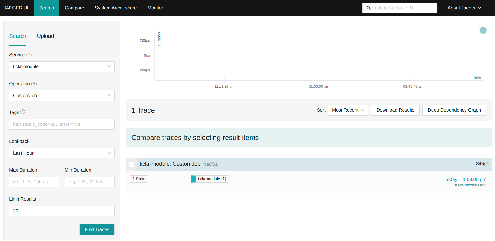

# springboot - microbase

springboot - microbase is an open-source starter project for quickly building `scalable` and `maintainable` Spring Boot-based microservices.

The project provides a solution for `centralized log collection` using Logstash, Elasticsearch, and Kibana, alongside `monitoring capabilities` with Prometheus, Jaeger, and Grafana. It also includes basic JPA functionality to facilitate database interactions.

For designing the `database schema`, we recommend using the following project: [Evocelot/liquibase-base ](https://github.com/Evocelot/liquibase-base).

## Technologies used

- Java 21
- SpringBoot 3.4.1
- Docker / Podman
- Make
- Elasticsearch
- Logstash
- Kibana
- Jaeger
- Prometheus
- Grafana

## How to use:

The project includes a `Makefile` that simplifies starting the application. Each target in the Makefile can be executed independently.

To run the application in a local container, execute the following command:

```bash
make start-local-container
```

> **_NOTE:_** If you want to run only the application itself (without ELK and observability tools), set the Spring profile to `dev`. This can be done inside the `Makefile`.

By default, the application runs on port `8080`.

The swagger UI can be accessed at: http://localhost:8080/swagger-ui/index.html

## Configuration

### Configuring via environment variables

When running the application in container, the following environment variables can be specified:

Environment variable | Sample value | Description |
--- | --- | --- |
SPRING_PROFILES_ACTIVE | dev | The profile to run with the application. Can be `dev` and/or `logstash`. |
LOGSTASH_HOST | logstash | The name of the logstash container to push the logs from the springboot app. It is only required when using the `logstash` profile. |
LOGSTASH_PORT | 5000 | The port of the logstash container. It is only required when using the `logstash` profile. |
TRACING_URL | http://jaeger:4318/v1/traces | The url of the jaeger instance for sending tracing details. |
SPRING_DATASOURCE_URL | jdbc:mariadb://evocelot-mariadb:3306/sample | The JDBC URL of the DBMS to connect to. |
SPRING_DATASOURCE_USERNAME | root | The username for connecting to the DBMS. |
SPRING_DATASOURCE_PASSWORD | admin | The password for connecting to the DBMS. |
SPRING_DATASOURCE_DRIVER_CLASS_NAME | org.mariadb.jdbc.Driver | The fully qualified name of the JDBC driver class used for the DBMS connection. |

### Configuring via properties file

The Spring Boot application can also be configured via properties files located in the `app/src/main/resources` directory.

Properties key | Sample value | Description |
--- | --- | --- |
... | ... | ... |


## local.env

The project includes a file named `local.env`, which stores the application details.

Environment variable | Sample value | Description |
--- | --- | --- |
APPNAME | sample-module | The name of the application |
VERSION | 0.0.1-SNAPSHOT | The version number of the application |

## Building the Docker Image

To build the Docker image for this application, use the following command:

```bash
make build-docker-image
```

This command reads the configuration from the `local.env` file, builds the Docker image with the specified settings, and tags it according to the `APPNAME` and `VERSION` values in the configuration.

## Logging

The project utilizes the `ELK stack` for `centralized log collection` and monitoring:

- Logstash: Extracts logs from the application and forwards them to Elasticsearch.
- Elasticsearch: Stores, indexes, and makes the application's logs searchable.
- Kibana: Provides a user interface for managing the logs stored in Elasticsearch.

> **_NOTE:_** To enable log forwarding to Logstash, set `SPRING_PROFILES_ACTIVE` to `logstash` in the container’s startup configuration.

View logs in Kibana:


## Monitoring

The project integrates the following tools for monitoring and observability:

- Jaeger: Collects and displays tracing information.
- Prometheus: Collects and stores application metrics.
- Grafana: Visualizes metrics in an intuitive interface.

To enable full monitoring capabilities (logs, tracing, and metrics), use the following command for starting the application:

```bash
make all
```

View tracing informations in Jaeger:


App monitoring in Grafana:


## Contributions

Contributions to the project are welcome! If you find issues or have suggestions for improvements, feel free to open an issue or submit a pull request.

## Documentation

For more documentation, see: [Documentation](/docs/docs.md)
