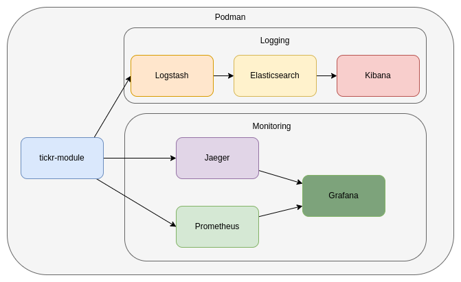

# springboot-microbase documentation

## Application Architecture  
The architectural design of the application is detailed in the diagram provided.

  

## Loggin request and response details.

This Spring Boot application features a custom interceptor that `logs detailed information about incoming requests and outgoing responses in JSON format`. Each request and response log is enriched with a unique trace identifier `REQUEST-ID` that is also included in the response headers.

### REQUEST-ID in Request and Response Headers

Adds or uses a custom header `REQUEST-ID` from the request to ensure traceability between request and response logs. If the `REQUEST-ID` header is not present in the request, a new one is generated and included in the response headers.
